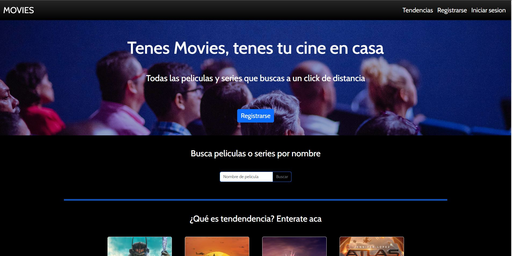
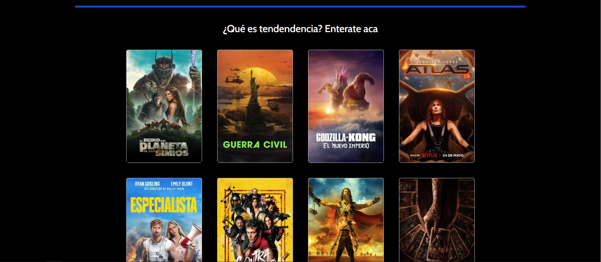
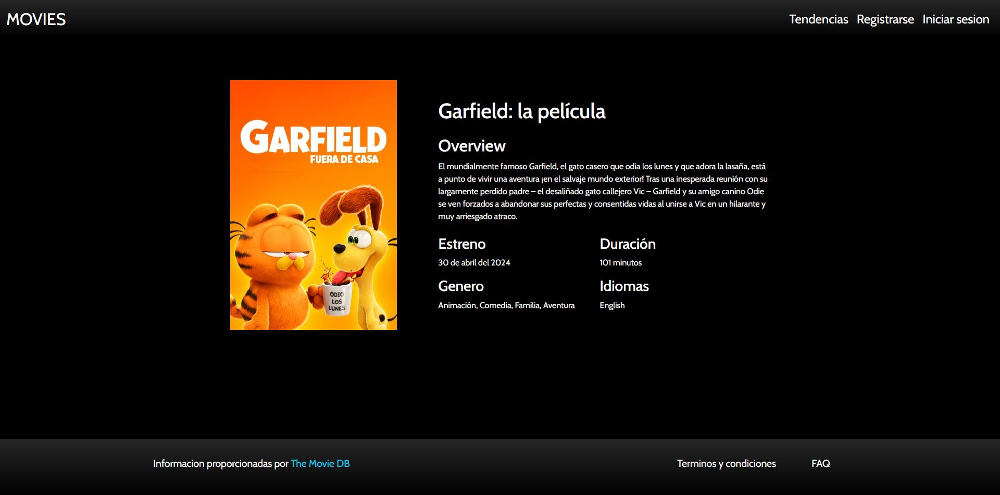
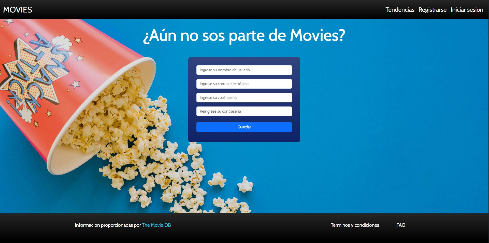
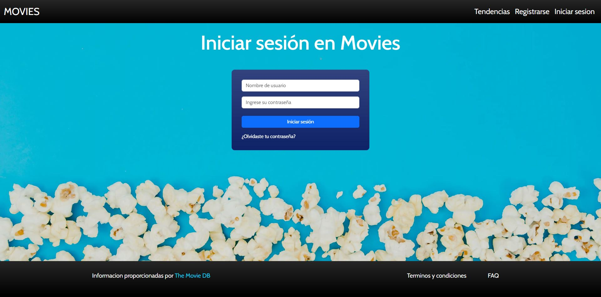

# Proyecto Codo A Codo: Sitio Web Dinámico

Este proyecto es un sitio web dinámico desarrollado como parte del curso "Codo a Codo". El objetivo principal es mostrar películas populares utilizando la API de "The Movie DB" y proporcionar funcionalidades adicionales como registro e inicio de sesión.

## Características Principales

- **Frontend**: Desarrollado con HTML, CSS y JavaScript.
- **Estilos**: Se utilizó Bootstrap para el diseño y estilos del sitio.
- **API**: Se utiliza la API de "The Movie DB" para obtener la información de las películas mostradas en el sitio.
- **Páginas**: El sitio cuenta con las siguientes páginas:
  - **Home**: Muestra las películas populares.
  - **Detalle de Película**: Permite ver información detallada de cada película.
- **Formularios**: Se implementan formularios de registro e inicio de sesión con validaciones desde funciones JavaScript.

## Autora

El proyecto fue desarrollado por **Aba Belen Romero** como parte del curso "Codo a Codo".

## Capturas de Pantalla

## Instalación y Uso

1. Clona este repositorio.
2. Abre el archivo `index.html` en tu navegador web.
3. Explora las diferentes páginas y funcionalidades del sitio.

---

Desarrollado con ❤️ por Ana Belen Romero
